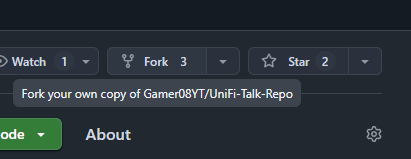
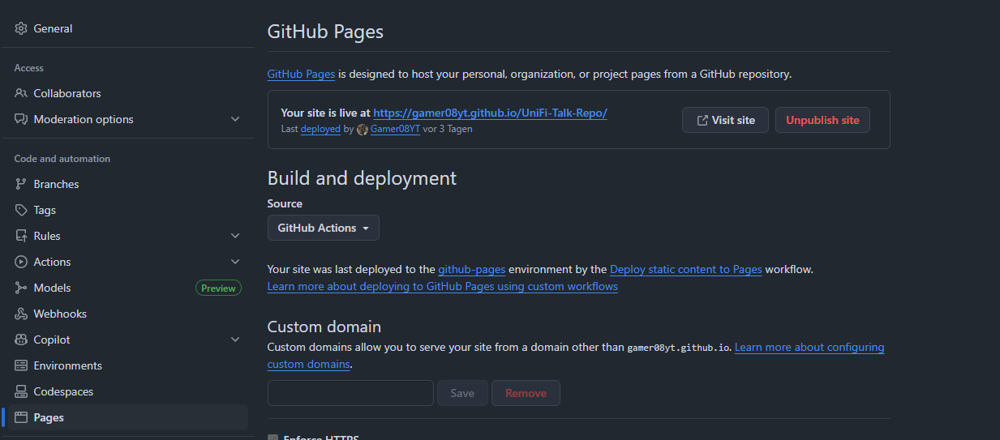

# UniFi-Talk-Repo
This repository provides an unofficial collection of SIP templates for UniFi Talk.

https://gamer08yt.github.io/UniFi-Talk-Repo/

## Info

The templates listed here have not been tested and may not work under certain circumstances.

In addition, they may differ from implemented templates; these are the initial templates that have been/are being submitted to Ubiquiti.

I welcome any feedback, as this will enable us to weed out templates that do not work or divide them into the respective contracts.

The more information you can provide about your connection (double NAT, contract, etc.), the better!

## Deprecated Telefonie Services

- Telekom:
  - DeutschlandLAN -> Will be migrated to Company Flex at the End of 2026!

## Contributing

Feel free to contribute, every help is appreciated!

### Templates

If you want to contribute a template, please a fork and then create a pull request.

Please provide as much information as possible.

**If you don't have a free account on GitHub, you can also contact me directly [via the Ubiquiti Forum](https://community.ui.com/user/JaXnPublic/a521c964-0aba-4ad4-89aa-b42b5066e8a5).**

**For local rendering/preview you Template please enable GitHub Pages on your forked Repo, otherwise the preview will not work.**

**_Please provide only working SIP Templates._**

### Repo Template Guidelines

To create an entry in the template list, please use the following [Template Format](./TEMPLATE.md)! 

#### Implementation in UniFi Talk

When you like, I can redirect the template to the official UniFi Talk Developer Team, wich will publish it.

Keep in mind that for this process we need your consent to test it on your side, if you don't want a test on your own console, there is a chance that Ubiquiti will send you a Console for testing.

### As with all of my repositories, I would like to point out that I am in no way affiliated with Ubiquiti or UniFi.
#### In this case, I will simply forward your templates and contact details to the correct address at Ubiquiti.
#### If you need to invite the development team to your console, the current test account is a user account with a Ubiquiti email address: unifitalk@ui.com

#### Via E-Mail
When communicating via E-Mail, please ensure that you are using a valid and secure domain that is exclusively used by Ubiquiti. (@ui.com)

#### Via Ubiquiti Forum 
When communicating via the forum, there is, unfortunately, no badge that verifies a team member, so be careful. 

## Disclaimer
#### I accept no liability for damage, data loss or other problems. 
#### Backups should always be made before accessing Ubiquiti remotely, as the custom firmware versions are dev previews that may contain errors.
#### Participation is at your own risk!